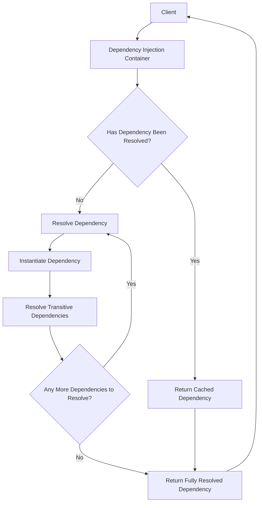

```mermaid
    graph TD;
    A[Client] --> B[Dependency Injection Container];
    B --> C{Has Dependency Been Resolved?};
    C -- No --> D[Resolve Dependency];
    C -- Yes --> E[Return Cached Dependency];
    D --> F[Instantiate Dependency];
    F --> G[Resolve Transitive Dependencies];
    G --> H{Any More Dependencies to Resolve?};
    H -- Yes --> D;
    H -- No --> I[Return Fully Resolved Dependency];
    E --> I;
    I --> A;
```